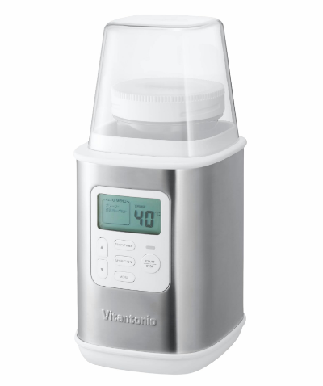
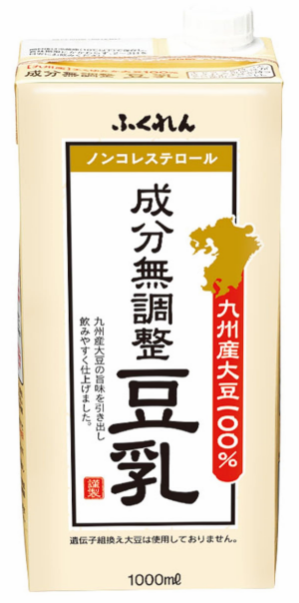
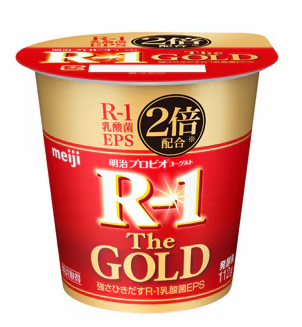

# 自家製ヨーグルト

## 機材

- Vitantonio ヨーグルトメーカー VYG-30

## 材料

- 豆乳
  - ふくれん、無調整豆乳

- ヨーグルト
  - 砂糖とか添加物が入ってないほうがいいよ
  - R1とかでもいい

## 作り方

1. 豆乳を200ml程度コップに注いで飲んでしまう。適当でいい。
2. 豆乳パックの上の部分を広げてハサミでカット。
3. その中にカップ一杯の市販のヨーグルトを入れる。
4. 熱湯消毒した長いスプーンでよく混ぜる。
5. 開いてる口にラップをかける。
6. ヨーグルトメーカーに入れて、40度で7時間セット。
7. 終わったら冷蔵庫で冷やす。
